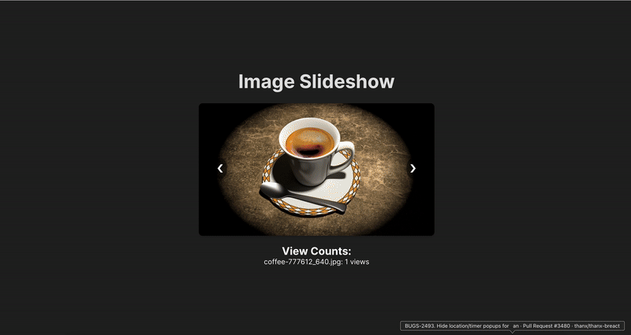

# Image Slideshow
A simple, responsive image slideshow built with React and TypeScript. Check out the project [here](https://image-slideshow.vercel.app/).



## Features

- A responsive image slideshow with next/previous buttons
- View count tracking for each image
- Continuous deployment via Vercel

## Technologies Used

- React
- TypeScript
- Vitest (for unit testing)
- Vercel (for CD)

## Getting Started

### Prerequisites

- Node.js (v16 or later)
- npm or yarn

### Installation

1. Clone the repository:
  ```bash
  git clone git@github.com:oliverphan/image-slideshow.git
  cd image-slideshow
  ```

2. Install dependencies
  ```bash
  npm install
  ```

### Running the App Locally
Start the development server:
  ```bash
  npm run dev
  ```

This will start the app on http://localhost:3000.

### Deployment
The project is continuously deployed to Vercel on pushes to the `main` branch.

### Running Tests
  `npm run test`